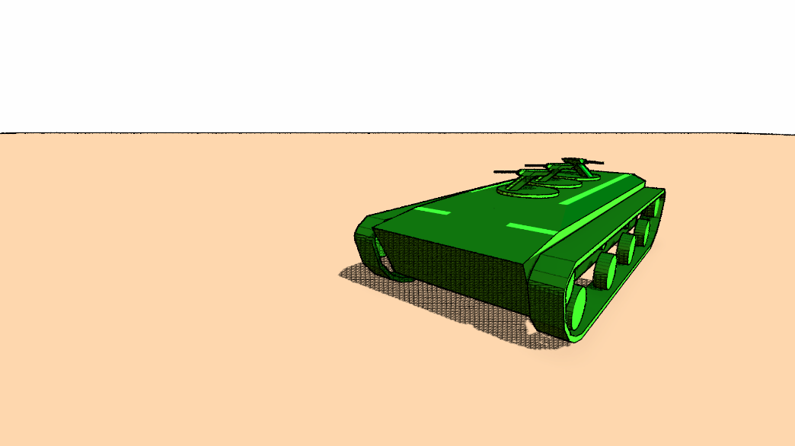

# What is that?

I wanted to make moba game with car controller, so I started that project. Here I use arcitecture from my other repo, object oriented programming, dependency injection and Network for GameObjects to interact on network. At the result project made it on a stage where there are some features, but no kind of gameplay. It is there, because those features are kind of pretty.

## Features inside the project

- Sobel filter

> To draw objects' borders I used Sobel filter to what is rendered in Unity

- Moebius style

> Game made in style of Moebius art: cross-hatched shadows, objects' borders, line thickness independent of distance. Happens to be cute.

- Render feature

> To apply what is above, it was convenient to make a Render Feature to make post-processing effect

- Car on wheels with physics

> Wheels have suspension, traction and acceleration. If you change wheel settings, you will get interesting car's behaviour of varying degrees of fun

## Link to a build

[Here](https://drive.google.com/drive/folders/15QzkAan3BVWGh94mQE2h_wiSG4G9WaQx) you can download the build and look at those features yourself

# Что это такое?

Мне хотелось сделать мобу с контроллером-машинкой, поэтому я начал этот проект. Здесь используется архитектура из моего другого репозитория, объектное программирование, инъекция зависимостей и Network for GameObjects для сетевого взаимодействия. В результате проект дожил до стадии, где есть кое-какие фичи, но нет никакого геймплея. Лежит тут, потому что фичи красивые.

## Особенности проекта

- Фильтр Собеля

> Для отрисовки границ объектов я применил фильтр Собеля к отрендеренном в юнити изображению

- Стиль Мёбиуса

> Игра сделана в стиле рисунков Мёбиуса: сделанные через cross-hatch тени, границы объектов, не зависящая от расстояния толщина линий. Вышло довольно мило

- Render feature

> Чтобы применить описанное выше, было удобно создать Render Feature, чтобы создать эффект пост-обработки.

- Машинка на физических колёсах

> Колёса имеют подвеску, коэффициент трения, ускорение. Если менять значения в настройках колёс, то можно получить поведение машинки разной степени забавности.

## Ссылка на сборку

[Здесь](https://drive.google.com/drive/folders/15QzkAan3BVWGh94mQE2h_wiSG4G9WaQx) можно скачать сборку и посмотреть на фичи самому